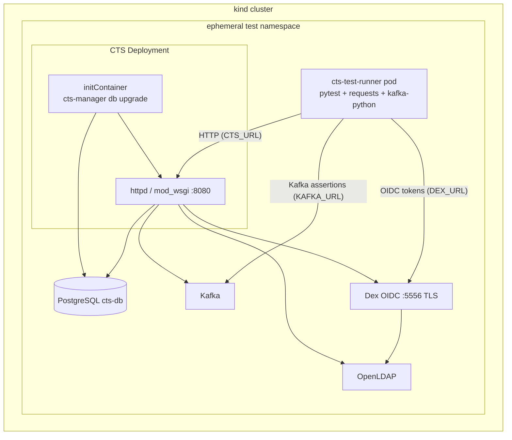

# Compose Tracking Service (CTS)

Compose Tracking Service stores metadata about Pungi composes, exposes a REST API,
and publishes change events to Kafka/UMB.

## Development

### Code style

Format with `black`, lint with `flake8`, and scan with `bandit`:

```bash
tox -e black,flake8,bandit
```

### Install and run locally

```bash
pip install -r requirements.txt
./create_sqlite_db
./start_cts_from_here
```

### Unit tests

```bash
tox -e py3
```

Unit tests bootstrap a full in-process Flask app via `tests/conftest.py` (no
`CTS_URL` required).

### Build documentation

```bash
tox -e docs
```

HTML output is in `docs/_build/html/`.

## Integration tests

Integration tests live in `tests/test_integration_api.py`. They call a **running**
CTS instance over HTTP and do not import the `cts` Python package (CI installs
only `pytest`, `requests`, and `kafka-python` in the test runner pod).

### Test environment

Local runs use [integration-tests/run-local.sh](integration-tests/run-local.sh),
which mirrors the Konflux EaaS pipeline on a **kind** cluster:



Manifests under [integration-tests/manifests/](integration-tests/manifests/)
define each service. Konflux CI uses the same layout in
[.tekton/integration-test-eaas.yaml](.tekton/integration-test-eaas.yaml).

### Run locally (recommended)

**Prerequisites:** `kind`, `kubectl`, `podman` or `docker`, `openssl`

```bash
./integration-tests/run-local.sh
```

Useful options:

```bash
./integration-tests/run-local.sh --skip-build     # reuse existing images
./integration-tests/run-local.sh --keep-cluster   # leave kind cluster running
./integration-tests/run-local.sh --no-tests       # deploy only
CONTAINER_ENGINE=docker ./integration-tests/run-local.sh   # force Docker instead of podman
```

With podman, images are loaded via `podman save` and `kind load image-archive`.
If image load still fails, try `CONTAINER_ENGINE=docker ./integration-tests/run-local.sh`.

### Run pytest manually

Against any reachable CTS (requires `pytest`, `requests`, and optionally
`kafka-python`):

```bash
CTS_URL=http://localhost:8080 \
  pytest tests/test_integration_api.py -v -o addopts=
```

Full stack (auth + Kafka checks), matching CI:

```bash
REQUESTS_CA_BUNDLE=/path/to/dex-ca.crt \
CTS_URL=http://cts:8080 \
AUTH_BACKEND=oidc_or_kerberos \
DEX_URL=https://dex:5556 \
KAFKA_URL=kafka:9092 \
  pytest tests/test_integration_api.py -v -s -o addopts=
```

When `CTS_URL` is set, `tests/conftest.py` skips local app bootstrap so pytest
does not need CTS Python dependencies.

### Environment variables

| Variable | Purpose |
|----------|---------|
| `CTS_URL` | Base URL of running CTS (**required**) |
| `AUTH_BACKEND` | `oidc_or_kerberos` or `openidc` for auth/workflow tests |
| `DEX_URL` | Dex base URL for OIDC token requests |
| `KAFKA_URL` | Enables Kafka message assertions |
| `REQUESTS_CA_BUNDLE` | Trust Dex self-signed CA |

See [docs/integration.rst](https://github.com/release-engineering/cts/blob/main/docs/integration.rst)
for CI pipeline details and manifest reference.
